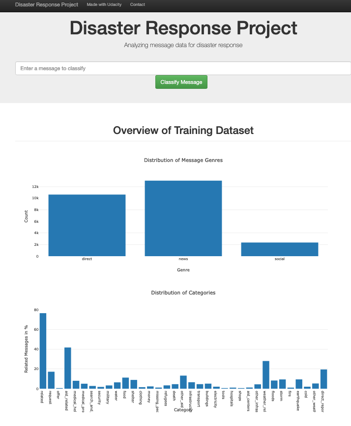
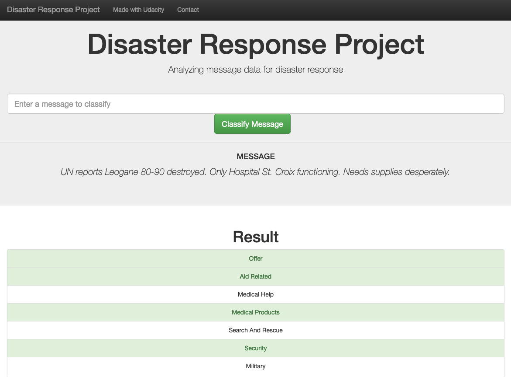
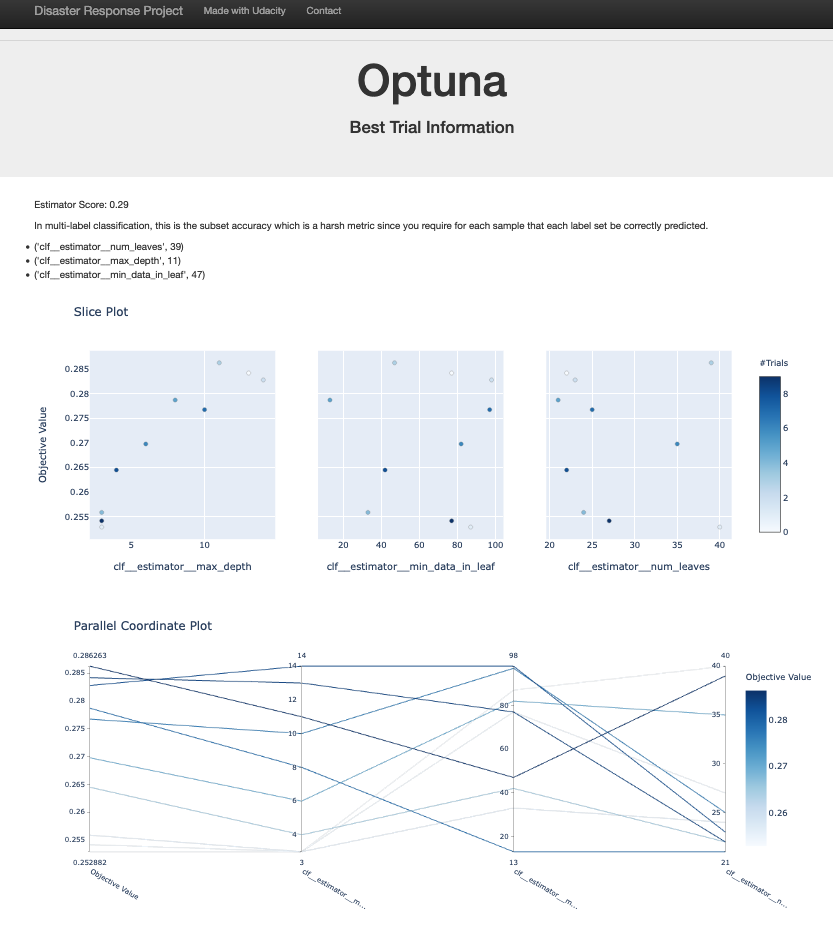

# nd025-disaster-response

### Summary
This project is part of the [Udacity](https://udacity.com) Datascientist Nanodegree Program. [Appen](https://appen.com/) provided a data set containing real messages that were sent during disaster events. For effective disaster response these messages must be categorized. Exactly this was the task here. 
Three main components have been developed.
* A data pipeline for processing the messages in the data set provided by [Appen](https://appen.com/).
* A ML pipeline to create a model that learned from the provided messages to classify new ones.
* A flask webapp 
### Files

      disaster_response_pipeline
      |-- app
            |-- templates
                    |-- go.html
                    |-- master.html
                    |-- model.html
            |-- run.py
      |-- data
            |-- disaster_message.csv
            |-- disaster_categories.csv
            |-- DisasterResponse.db
            |-- process_data.py
      |-- models
            |-- classifier.pkl
            |-- train_classifier.py
      |-- notebooks
            |-- ETL Pipeline Preparation.ipynb
            |-- ML Pipeline Preparation.ipynb
      |-- screenshots
            |-- dataset.png
            |-- optuna.png
            |-- query.png
      |-- README
      |-- nd025-disaster-response.yaml
      |-- requirements.txt

- App: folder with the html templates for the application and *run.py* to start the web application.
- Data: folder with the raw data *disaster_categories.csv* and *disaster_messages.csv*. *DisasterResponse.db* is the sqlite database with the raw data processed by *process_data.py* which
    * Loads the messages and categories datasets
    * Merges the two datasets
    * Cleans the data
    * Stores it in a SQLite database
- Models: folder with *classifier.pkl*, the saved model produced by *train_classifier.py* which
    * Loads data from the SQLite database
    * Splits the dataset into training and test sets
    * Builds a text processing and machine learning pipeline
    * Trains and tunes a model
    * Outputs results on the test set
    * Exports the final model as a pickle file
-  Screenshots: Contains the png files shown below. 
- This README file
- notebooks: Contains exploratory jupyter notebooks not necessary for this project
- nd025-disaster-response.yaml: A yaml-file specifiying the requirements for this project. Can also be used to set up an AWS Sagemaker-Studio Conda environment.
- requirements.txt: Libraries used for this project.

### Instructions
1. Run the following commands in the project's root directory to set up your database and model.

    - To run ETL pipeline that cleans data and stores in database
        `python data/process_data.py data/disaster_messages.csv data/disaster_categories.csv data/DisasterResponse.db`
    - To run ML pipeline that trains classifier and saves
        `python models/train_classifier.py data/DisasterResponse.db models/classifier.pkl`

2. Go to `app` directory: `cd app`

3. Run your web app: `python run.py`

4. Click the `PREVIEW` button to open the homepage

### Screenshots
#### Home
The homepage shows the distribution of message genres and categories

#### Query
On the *go* page messages can be entered for classification

#### Optuna
On the *model* page screenshots of the optuna hyperparameter tuning results are shown.

### Acknowledgements
Thanks to [Udacity](https://udacity.com) for preparing this project and [Appen](https://appen.com/) for providing the dataset.
